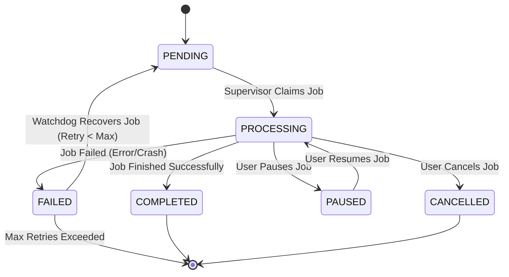

# Fault-Tolerant Job Tracking System Design

## 1. System Overview
The system uses a Supervisor-Worker architecture to manage web crawling jobs. The Supervisor is responsible for polling jobs, spawning Workers (Runners), and monitoring their health. The database (PostgreSQL/Supabase) acts as the source of truth for job state.

## 2. State Machine

The `crawl_jobs` table uses a `job_status` enum with the following states:



### State Transitions
- **PENDING**: Job created, waiting for worker.
- **PROCESSING**: Worker claimed job, heartbeat active.
- **COMPLETED**: Worker finished successfully.
- **FAILED**: Worker reported failure or Watchdog detected crash (stale heartbeat).
- **PAUSED**: User requested pause. Worker stops processing new URLs but saves state.
- **CANCELLED**: User requested cancellation.

## 3. Database Schema Updates

### Existing Schema
- `crawl_jobs`: Tracks job metadata, status, and heartbeats.
- `crawl_states`: Tracks crawling progress (frontier, visited URLs).

### Proposed Changes
To improve "Pending Work Quantification" and query performance, we will add a `total_pending` column to `crawl_states`.

```sql
ALTER TABLE crawl_states ADD COLUMN IF NOT EXISTS total_pending INTEGER DEFAULT 0;
```

This allows the UI to quickly sum `total_pending` across active jobs without parsing large JSONB arrays.

## 4. Crash Recovery Algorithm (The Watchdog)

The Supervisor will run a background "Watchdog" task that runs every 60 seconds.

### Logic
1.  **Identify Stale Jobs**:
    ```sql
    SELECT * FROM crawl_jobs 
    WHERE status = 'processing' 
    AND last_heartbeat < NOW() - INTERVAL '2 minutes';
    ```
2.  **Recover or Fail**:
    For each stale job:
    -   Increment `retry_count`.
    -   If `retry_count < max_retries`:
        -   Update `status = 'pending'`.
        -   Clear `worker_id`.
        -   Log "Recovering stale job {id} (Retry {retry_count}/{max_retries})".
    -   Else:
        -   Update `status = 'failed'`.
        -   Set `error_message = 'Job crashed and exceeded max retries'`.
        -   Log "Job {id} failed permanently".

## 5. Heartbeat Mechanism

-   **Supervisor**: Updates `last_heartbeat` every 10 seconds while the Runner process is alive.
-   **Runner**: (Optional but recommended) Can also update heartbeat during long operations if Supervisor monitoring is insufficient, but Supervisor-based heartbeat is safer against Runner freezes.

## 6. Pending Work Quantification

-   **Checkpointing**: When `crawl_states` is updated (checkpoint), the `total_pending` column will be updated with `len(frontier)`.
-   **UI Query**: `SELECT SUM(total_pending) FROM crawl_states JOIN crawl_jobs ON ... WHERE status = 'processing'`.

## 7. Implementation Plan
1.  Apply SQL migration for `total_pending`.
2.  Update `crawling_service.py` to populate `total_pending` during checkpoints.
3.  Update `supervisor.py` to include the Watchdog task.
